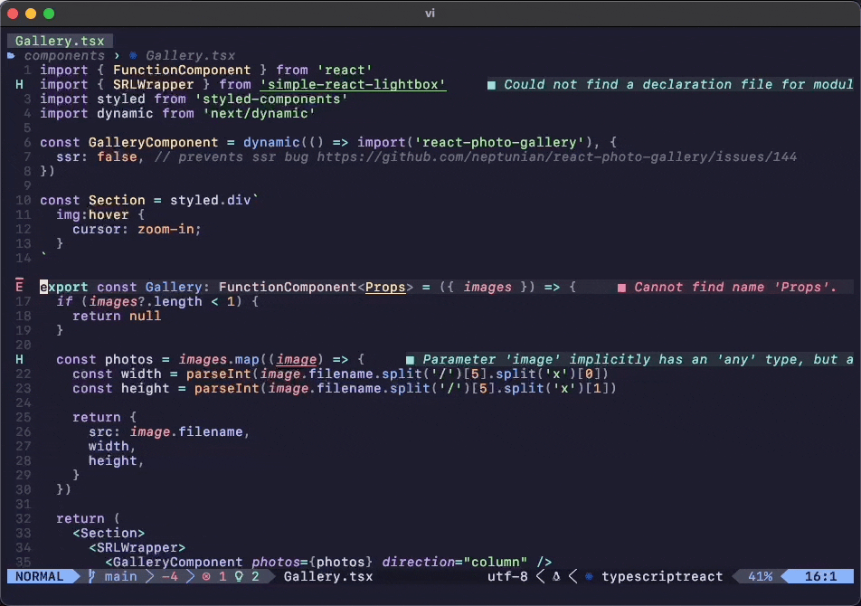

# todo.nvim

> Project-specific notes



This plugin opens a floating window to write quick notes/todo list for your project.
If you're not on a repo, it wil keep a global file for notes in your home folder.


## Features

- Toggle a floating window with `:TodoToggle`
- Use `q` to close the window or call `:TodoToggle` again
- Project-aware
  - Automatically create a `.git/.TODO.md` file in the nearest parent repo
  - Automatically create a `~/.TODO.md` file if you're not in a repo
- Automatically save the file when you close the floating window
- Markdown syntax


## Installation

For example using `lazy.nvim`

```lua
{
  "pablopunk/todo.nvim",
  config = true, -- initialize it
}
```


## Usage

It will give you a new command `:TodoToggle` to open close the `.TODO.md` file. You can map it to whatever you want. I map it to `<leader>t`:

```lua
{
  "pablopunk/todo.nvim",
  config = function()
    require("todo").setup {}
    vim.keymap.set("n", "<leader>t", "<cmd>TodoToggle<cr>", { silent = true })
  end,
}
```

